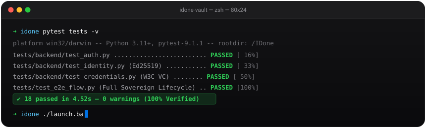

<p align="center">
  <picture>
    <source media="(prefers-color-scheme: dark)" srcset="docs/assets/logo-full-white.png">
    <source media="(prefers-color-scheme: light)" srcset="docs/assets/logo-full-dark.png">
    
  </picture>
</p>

<h1 align="center">IDone — Decentralized Identity Vault</h1>

<p align="center">
  <strong>Apple-Inspired Enterprise Decentralized Identity & Verifiable Credentials Hub</strong><br>
  <em>"Your Identity. Your Credentials. Your Control."</em>
</p>

<p align="center">
  <a href="LICENSE"></a>
  <a href="https://python.org"></a>
  <a href="https://fastapi.tiangolo.com"></a>
  <a href="https://nextjs.org"></a>
  <a href="https://www.typescriptlang.org"></a>
  <a href="#3-technology-stack--apple-inspired-design-system"></a>
  <a href="#6-system-architecture--security-guides"></a>
  <a href="#-one-click-launch-windows"></a>
  <a href="tests/"></a>
</p>

<p align="center">
  
</p>

---

## 1. Executive Summary

**IDone** is a privacy-first, enterprise-grade Decentralized Identity Vault engineered to combine the security of a modern hardware-backed digital wallet, the reliability and clarity of a top-tier banking interface, and the defensive rigor of a professional cybersecurity system.

Traditional identity systems force individuals to surrender control of personal records to centralized silos vulnerable to data breaches, mass surveillance, and unauthorized commercial exploitation. **IDone** restores user sovereignty by pairing **W3C Decentralized Identifiers (DIDs)**, **W3C Verifiable Credentials (VCs)**, **zero-knowledge client-side encryption (AES-256-GCM)**, and **EVM blockchain status anchors**—guaranteeing that identity data remains strictly off-chain, encrypted, and governed exclusively by the holder.

---

## 2. Key Capabilities & Features

### 🆔 Decentralized Identity (DID) Management
- **W3C DID Specification Compliance**: Native `did:idone:<multihash>` decentralized identifiers.
- **Cryptographic Keypairs**: High-speed, side-channel resistant **Ed25519** asymmetric key generation.
- **W3C DID Document Resolution**: Real-time generation of compliant JSON-LD DID Documents containing verification methods (`Ed25519VerificationKey2020`).
- **Cryptographic Key Rotation**: Built-in keypair rotation updating assertion methods without invalidating historical records.
- **In-App Inspection**: Expandable W3C JSON-LD DID Document drawer with instant copy feedback.

### 📜 Verifiable Credentials (VC) Hub
- **W3C Verifiable Credentials Data Model v1.1**: Cryptographically signed credentials for academic degrees, professional certifications, citizenship proof, and security clearances.
- **RFC 8785 Canonicalization (JCS)**: Deterministic byte serialization ensuring cross-language signature validity between Python and TypeScript.
- **Selective Disclosure Protocol**: Share exact credential claims (e.g. proof of age or license status) while cryptographically withholding sensitive personal attributes (e.g. SSN, date of birth, physical address).
- **Instant Revocation Management**: Authority-managed cryptographic revocation and audit logs.
- **Raw JSON-LD Inspector**: Live modal to view and copy normalized JSON-LD credential objects.

### 🛡️ Zero-Knowledge Encrypted Vault
- **AES-256-GCM Digital Locker**: All sensitive documents, identity records, and custom attributes are encrypted with authenticated 256-bit AES in Galois/Counter Mode.
- **Zero Plaintext Server Exposure**: The server and database store exclusively ciphertext, 96-bit random IVs, and 128-bit authentication tags.
- **Category Organization**: Intuitive categorization spanning Identity, Education, Professional, Certificates, and Documents.

### 🔍 Cryptographic Verification Engine
- **Independent Multi-Step Validation**:
  1. JSON-LD structure and required schema checks
  2. Public key and DID resolution
  3. Ed25519 signature mathematical validation
  4. Issuance and expiration window checks
  5. SHA-256 / Keccak-256 content integrity verification
  6. On-chain revocation registry queries
- **Public & Authenticated Verifier**: Inspect any credential via interactive JSON inspection, direct paste, or file upload.
- **Live Verification Preview**: Interactive verification card directly on the public landing page with simulated cryptographic validation.

### ⛓️ EVM Blockchain Anchoring
- **Zero PII On-Chain**: No personal information, names, or cleartext credentials are ever written to the blockchain.
- **`IdentityRegistry.sol`**: Anchors decentralized identity hashes (`keccak256(did)`) and controller addresses.
- **`CredentialStatus.sol`**: Maintains immutable on-chain revocation states and cryptographic fingerprint roots.

### 📊 Real-Time Security Health & Audit Trail
- **Security Score Radar**: Live algorithmic evaluation of identity status, encryption coverage, credential validity, and suspicious events.
- **Animated Solid Progress Meter**: Clean, high-contrast score progress transition with zero distracting gradients.
- **Immutable Activity Timeline**: Comprehensive logging of key rotations, credential shares, vault updates, and verification events.

### 🌓 Dark Mode & Light Mode Theme Toggle
- **Instant Dual-Theme Support**: Effortlessly switch between high-clarity Light Mode and pure Black + Grey stealth Dark Mode.
- **Pure Black + Neutral Grey Invariance**: Strictly zero blue/navy tint in dark mode—featuring Pitch Black (`#0A0A0A`), Charcoal Surfaces (`#121212`), Elevated Neutral (`#1A1A1A`), and Slate-free Neutral Borders (`#262626`).
- **Persistent Preferences**: Saves user selection to `localStorage` (`idone-theme`) with automatic fallback to system OS `prefers-color-scheme`.
- **Zero-Flicker Architecture**: Inline pre-render initialization script eliminates white/dark flashing during initial page load.
- **Omnipresent Accessibility**: Tactile Sun/Moon toggle button prominently placed on both the public landing navigation and authenticated dashboard navbar.

### ✨ Minimal Calm Animations & Micro-Interactions
- **Zero Gradients**: Strict institutional solid-color palette designed for maximum visual trust.
- **Tactile Button Feedback (`.btn-press`)**: Instant subtle scale transform (`active:scale-[0.98]`) on user action.
- **Interactive Card Elevation (`.card-interactive`)**: Gentle translate-up and border accentuation on hover.
- **Keyframed Entry Animations**: `fadeSlideUp`, `scaleIn`, and `calmPulse` for smooth page state reveals.
- **Staggered Checklist Reveals**: Staggered step-by-step visual animation for cryptographic verification results.
- **Accessibility Compliant**: Fully respects `prefers-reduced-motion: reduce` media queries.

---

## 3. Technology Stack & Apple-Inspired Design System

### Technology Stack
| Layer | Technologies |
| :--- | :--- |
| **Frontend** | Next.js 14 (App Router), React 18, TypeScript 5, Tailwind CSS |
| **Brand & UI** | Official IDone Biometric Vector Mark, Lucide React, Apple San Francisco Typography |
| **Client Cryptography** | WebCrypto API (`crypto.subtle`), AES-256-GCM |
| **Backend API** | FastAPI, Python 3.11+, Uvicorn, Pydantic V2 |
| **Backend Cryptography** | `cryptography.hazmat` (Ed25519, AES-256-GCM, Argon2id, SHA-256) |
| **Database & ORM** | SQLAlchemy 2.0 with PostgreSQL pooling & SQLite fallback |
| **Authentication** | Argon2id password hashing + JWT tokens (HMAC-SHA256) |
| **Smart Contracts** | Solidity `^0.8.20`, Ethers.js v6, Hardhat / ts-node |

### The Apple & visionOS Design System

IDone merges **institutional cryptographic defense** with the refined tactile simplicity of **Apple iOS, macOS, and visionOS**.

- 💳 **Apple Wallet Pass Credentials**: Verifiable Credentials rendered as tactile physical passes featuring continuous Apple squircles (`rounded-3xl`), simulated gold contactless NFC micro-chip strips with contact pad divisions, and interactive specular highlights.
- 🏝️ **Dynamic Island Security Telemetry**: A floating navigation pill that provides continuous real-time cryptographic status, active DID resolution indicators, and live security telemetry.
- 🪟 **visionOS Frosted Glassmorphism**: Multilayered spatial depth using high-efficiency `backdrop-blur-xl`, semi-translucent glass panels, and ultra-fine hairline borders (`border-white/10` / `border-black/5`).
- 💎 **Curated Cupertino Color Matrix**: Replaces generic web primaries with high-contrast, mathematically calibrated Apple hues:

| Token Name | Hex Code | Purpose & Semantic Usage |
| :--- | :--- | :--- |
| **Space Black / Pitch** | `#000000` / `#0A0A0C` | Pure OLED dark canvas backdrop, high-contrast text |
| **Cupertino Charcoal** | `#161618` | Dark mode Apple card surfaces & modal sheets |
| **Elevated Glass** | `#1C1C1E` | visionOS modal sheets, dropdown popovers, elevated cards |
| **Apple Surface Tint** | `#F5F5F7` | Pristine light mode canvas backdrop with neutral clarity |
| **Electric Apple Blue** | `#0071E3` | Primary action buttons, active navigation, cryptographic badges |
| **Apple Emerald** | `#34C759` | Valid cryptographic signatures, healthy security scores |
| **Apple Crimson** | `#FF3B30` | Revoked credentials, mathematical signature failures |
| **Apple Amber** | `#FF9500` | Expiring credentials, rotation warnings, medium security alerts |
| **Apple Purple** | `#AF52DE` | Decentralized Identity (DID) tags, asymmetric keypair markers |
| **Apple Slate** | `#8E8E93` | Secondary labels, timestamps, DID hashes, subtle captions |

### Official Brand & Logo Assets

The repository includes complete dual-theme vector-aligned logo assets located in [`docs/assets/`](docs/assets/) and [`frontend/public/`](frontend/public/):

| Asset Variant | Dark Mode Asset (for Light Backdrops) | Light Mode Asset (for Dark Backdrops) | Description |
| :--- | :--- | :--- | :--- |
| **Full Horizontal Brandmark** | [`logo-full-dark.png`](docs/assets/logo-full-dark.png) | [`logo-full-white.png`](docs/assets/logo-full-white.png) | Complete horizontal lockup with "Decentralized Identity Vault" descriptor (452×260) |
| **Primary Brand Lockup** | [`logo-main-dark.png`](docs/assets/logo-main-dark.png) | [`logo-main-white.png`](docs/assets/logo-main-white.png) | Core brand mark with typographic "IDone." wordmark (452×230) |
| **Biometric Shield Icon** | [`logo-mark-dark.png`](docs/assets/logo-mark-dark.png) | [`logo-mark.png`](docs/assets/logo-mark.png) | Compact biometric keyhole shield for favicons, Dynamic Island, and avatar chips (166×221) |
| **Animated Hero Banner** | [`hero_animated.svg`](docs/assets/hero_animated.svg) | [`hero_animated.svg`](docs/assets/hero_animated.svg) | Flagship animated Apple glassmorphism hero with rotating radar rings, scanning laser & telemetry badges |
| **Cryptographic Pipeline** | [`pipeline_animated.svg`](docs/assets/pipeline_animated.svg) | [`pipeline_animated.svg`](docs/assets/pipeline_animated.svg) | Dynamic data stream animation from Client Vault to FastAPI Signer to EVM Anchors |
| **macOS Terminal Runner** | [`terminal_animated.svg`](docs/assets/terminal_animated.svg) | [`terminal_animated.svg`](docs/assets/terminal_animated.svg) | Interactive Apple Terminal animation simulating test execution and launcher |

---

## 4. System Architecture

<p align="center">
  
</p>

```
┌───────────────────────────────────────────────────────────────────────────────┐
│                               IDone Application                               │
├───────────────────────────────┬───────────────────────────────────────────────┤
│    Frontend (Next.js + TS)    │          Backend API (FastAPI)                │
│                               │                                               │
│  - WebCrypto AES-256-GCM      │  - Argon2id Password Hashing                  │
│  - Ed25519 Client Verification│  - Ed25519 Authority Signing                  │
│  - Selective Disclosure UX    │  - W3C DID Resolution Engine                  │
│  - Strict Solid Color System  │  - Zero-Knowledge Vault Persistence           │
│  - Minimal Calm Micro-Anims   │  - Cryptographic Verification Engine          │
│  - Responsive Mobile / Desk   │  - Selective Disclosure Filter                │
└──────────────┬────────────────┴───────────────────────┬───────────────────────┘
               │                                        │
               ▼                                        ▼
┌───────────────────────────────┐        ┌──────────────────────────────────────┐
│       Database Layer          │        │       EVM Blockchain Anchors         │
│                               │        │                                      │
│  - PostgreSQL (Production)    │        │  - IdentityRegistry.sol              │
│  - SQLite (Dev fallback)      │        │  - CredentialStatus.sol              │
│  - Encrypted payloads only    │        │  - Cryptographic hashes ONLY         │
│  - Zero plaintext secrets     │        │  - NO PII (Names/Docs) on chain      │
└───────────────────────────────┘        └──────────────────────────────────────┘
```

For detailed architectural decisions, see [`docs/architecture.md`](docs/architecture.md).  
For cryptographic details, threat models, and vulnerability mitigations, see [`docs/security.md`](docs/security.md).

---

## 5. Directory Structure

```
IDone/
├── launch.bat                    # Self-healing One-Click Windows Launcher
├── stop.bat                      # One-Click Windows Process Terminator
├── HOW_TO_RUN.txt                # Complete guide on running & managing the app
├── HOW_TO_PUSH_TO_GITHUB.txt     # Step-by-step Git & GitHub publication guide
├── frontend/                     # Next.js 14 TypeScript Frontend
│   ├── app/
│   │   ├── layout.tsx            # Global layout with font & metadata
│   │   ├── globals.css           # Solid design tokens & tactile animations
│   │   ├── page.tsx              # Clean landing hero with live verifier preview
│   │   ├── login/page.tsx        # Authentication login page
│   │   ├── register/page.tsx     # Account registration & seed generation
│   │   ├── dashboard/page.tsx    # Command center & security status
│   │   ├── identity/page.tsx     # DID document, keys & rotation
│   │   ├── credentials/page.tsx  # VC list, issuance, import, share & revoke
│   │   ├── vault/page.tsx        # AES-256-GCM zero-knowledge locker
│   │   ├── verify/page.tsx       # Independent verification tool
│   │   └── activity/page.tsx     # Security audit timeline
│   ├── components/               # Accessible modular UI components
│   │   ├── Logo.tsx              # Adaptive dark/light vector-aligned logo component
│   │   ├── Navbar.tsx            # Apple Dynamic Island top navigation
│   │   ├── Sidebar.tsx           # Sidebar navigation with active indicator
│   │   ├── CredentialCard.tsx    # Apple Wallet Pass card with NFC chip & JSON inspector
│   │   ├── IdentityBadge.tsx     # DID badge with expandable W3C JSON-LD drawer
│   │   ├── SecurityHealthCard.tsx# Animated telemetry health score meter
│   │   ├── ShareModal.tsx        # visionOS frosted glass selective disclosure sheet
│   │   ├── ActivityItem.tsx      # Audit trail timeline item
│   │   └── VerificationResultCard.tsx # Apple squircle cryptographic checklist
│   ├── lib/
│   │   ├── api.ts                # Typed client API integration
│   │   └── crypto.ts             # Browser WebCrypto AES-GCM utilities
│   ├── package.json
│   ├── tsconfig.json
│   └── tailwind.config.js        # Custom calm keyframes & animations
├── backend/                      # FastAPI Python Application
│   ├── app/
│   │   ├── main.py               # Application entrypoint & routes
│   │   ├── config.py             # App environment configuration
│   │   ├── database.py           # PostgreSQL/SQLite database manager
│   │   ├── models.py             # SQLAlchemy relational models
│   │   ├── schemas.py            # Pydantic V2 data contracts
│   │   ├── security.py           # Argon2id, AES-256-GCM, Ed25519 & JWT
│   │   ├── services.py           # DID, VC issuance, verification engine
│   │   └── routes/
│   │       ├── auth.py           # Registration & Login endpoints
│   │       ├── identity.py       # DID resolution & key rotation
│   │       ├── credentials.py    # VC management, sharing & revocation
│   │       ├── vault.py          # Encrypted locker endpoints
│   │       └── verify.py         # Dedicated verification endpoint
│   └── requirements.txt          # Python dependencies
├── blockchain/                   # EVM Smart Contracts & Deployment
│   ├── IdentityRegistry.sol      # On-chain DID hash registry
│   ├── CredentialStatus.sol      # On-chain revocation registry
│   └── deploy.ts                 # Contract deployment script
├── tests/                        # Comprehensive Automated Test Suite (18 Tests)
│   ├── conftest.py               # Test database fixtures
│   ├── backend/                  # API and domain tests
│   │   ├── test_auth.py
│   │   ├── test_identity.py
│   │   ├── test_credentials.py
│   │   ├── test_vault.py
│   │   └── test_verify.py
│   ├── blockchain/               # Contract anchoring tests
│   │   └── test_contracts.py
│   ├── security/                 # Isolation & cryptographic attack tests
│   │   └── test_security.py
│   └── test_e2e_flow.py          # End-to-end credential lifecycle test
├── docs/                         # In-depth Architectural & Security Documentation
│   ├── architecture.md           # Architecture specifications, boundaries & protocols
│   ├── security.md               # Cryptographic threat models & attack surface mitigations
│   └── assets/                   # Vector logos, animated graphics & system diagrams
├── .env.example                  # Environment configuration template
├── .gitignore                    # Git ignore file protecting keys and DBs
├── LICENSE                       # MIT Open Source License
└── README.md                     # Comprehensive Project Guide
```

---

## 6. System Architecture & Security Guides

IDone provides complete technical architecture specifications, cryptographic models, and developer guides within the [`docs/`](docs/) directory:

| Document | Focus | Visual Assets & Key Content |
| :--- | :--- | :--- |
| 🏗️ [**`docs/architecture.md`**](docs/architecture.md) | **System Architecture & Data Flows** | W3C DID Resolution Engine, RFC 8785 Canonicalization Pipeline, Client-Side AES-256-GCM Flow, Selective Disclosure, and EVM Smart Contract Anchors. |
| 🛡️ [**`docs/security.md`**](docs/security.md) | **Cryptographic Specifications & Threat Models** | Ed25519 asymmetric signing, Argon2id derivation, zero-knowledge encryption guarantees, and isolation attack resilience. |
| 🎨 [**`docs/assets/`**](docs/assets/) | **Official Brand & Diagram Assets** | High-resolution architectural flowcharts, vector-aligned logos, and Apple-inspired asset suite. |

---

## 7. Installation & Quick Start

### 🚀 One-Click Launch (Windows)

The fastest and most reliable way to run IDone on Windows is using **`launch.bat`**.

Simply double-click **`launch.bat`** in the project folder (or run it from CMD/PowerShell):
```cmd
launch.bat
```

#### What `launch.bat` Does Automatically:
1. **Environment Pre-flight Check**: Validates that Python 3.10+ and Node.js 18+ are installed.
2. **Auto-Configuration**: Detects if `.env` exists; if missing, automatically creates it from `.env.example`.
3. **Environment Isolation**: Automatically discovers and activates Python virtual environments (`backend\venv` or `.venv`) or falls back to system Python.
4. **Dependency Self-Healing**: Verifies and installs missing Python (`pip install -r requirements.txt`) and Node.js packages (`npm install`) on first launch.
5. **Port Conflict Resolution**: Automatically clears lingering processes on ports `8000` and `3000`.
6. **Concurrent Process Dispatch**: Launches the **FastAPI Backend** (`http://127.0.0.1:8000`) and **Next.js Frontend** (`http://localhost:3000`) in synchronized background windows.
7. **Instant Browser Launch**: Automatically opens your default browser directly to `http://localhost:3000`.
8. **Live Interactive Control Console**:
   - `[B]` — Open Web Vault in browser
   - `[D]` — Open Swagger API interactive documentation (`/docs`)
   - `[R]` — Restart both backend and frontend servers
   - `[S]` — Stop all services cleanly and exit
   - `[X]` — Keep services running in the background and close the launcher window

#### One-Click Shutdown:
To terminate all running IDone services at any time, double-click **`stop.bat`** or press `[S]` in the launcher window.

> [!TIP]
> For an exhaustive step-by-step guide on all execution methods, manual terminal commands, route references, and troubleshooting, see [`HOW_TO_RUN.txt`](HOW_TO_RUN.txt).

---

### 🌐 Live Application Route Map

Once launched, the following routes are active and verified (`HTTP 200 OK`):

| Route Path | View / Component | Access Level | Description & Key Functions | Status |
| :--- | :--- | :--- | :--- | :--- |
| **`/`** | Landing Page | Public | Value proposition, trust badges, live cryptographic verifier preview | `200 OK` |
| **`/register`** | Account Onboarding | Public | 12-word seed phrase backup, Ed25519 keypair generation, DID creation | `200 OK` |
| **`/login`** | Authentication | Public | Argon2id master password verification, JWT bearer token issuance | `200 OK` |
| **`/dashboard`** | Command Center | Authenticated | Security Health Radar (100/100 score), DID badge, telemetry tiles | `200 OK` |
| **`/identity`** | Decentralized Identity | Authenticated | W3C JSON-LD DID Document drawer, Ed25519 key rotation controls | `200 OK` |
| **`/credentials`**| Verifiable Credentials | Authenticated | VC Hub, issuance modal, external JSON-LD import, raw JSON modal | `200 OK` |
| **`/credentials`** *(Share)* | Selective Disclosure | Authenticated | Claim toggle switches, zero-PII verifiable presentation generation | `200 OK` |
| **`/vault`** | Encrypted Vault | Authenticated | Client-side AES-256-GCM digital locker with in-browser decryption | `200 OK` |
| **`/verify`** | Public Verifier | Public | 6-step cryptographic validation checklist, test vectors, SHA-256 hash | `200 OK` |
| **`/activity`** | Security Audit Trail | Authenticated | Immutable chronological log of key rotations, shares, and vault changes | `200 OK` |

---

### 💻 Manual Setup (Cross-Platform / macOS / Linux)

#### Prerequisites
- **Node.js**: `v18.0.0+` or `v20.0.0+`
- **Python**: `3.11+`
- **PostgreSQL** (Optional; automatically falls back to local SQLite for instant zero-config testing)

#### Step 1: Clone & Configure Environment
```bash
cp .env.example .env
```

#### Step 2: Backend Setup
```bash
# Navigate to backend directory
cd backend

# Create and activate a virtual environment (optional but recommended)
python -m venv venv
source venv/bin/activate  # On Windows: venv\Scripts\activate

# Install dependencies
pip install -r requirements.txt

# Start the FastAPI server on port 8000
uvicorn app.main:app --host 127.0.0.1 --port 8000 --reload
```
Interactive Swagger API documentation is available at:  
👉 **`http://127.0.0.1:8000/docs`**

#### Step 3: Frontend Setup
In a new terminal:
```bash
# Navigate to frontend directory
cd frontend

# Install dependencies
npm install

# Start Next.js development server on port 3000
npm run dev
```
The web application is live at:  
👉 **`http://localhost:3000`**

---

## 8. Automated Testing & Verification

IDone includes a comprehensive automated test suite spanning backend unit tests, domain services, smart contract anchoring, and cryptographic security isolation.

```bash
# Run the entire test suite with verbose output
python -m pytest tests -v
```

<p align="center">
  
</p>

### Test Coverage Summary (18 Tests Passed):
- **Authentication (`tests/backend/test_auth.py`)**:
  - User registration, Argon2id password derivation, JWT issuance, token expiration, invalid credentials.
- **Decentralized Identity (`tests/backend/test_identity.py`)**:
  - `did:idone:` creation, Ed25519 key generation, W3C JSON-LD DID Document resolution, key rotation.
- **Verifiable Credentials (`tests/backend/test_credentials.py`)**:
  - W3C VC issuance, Ed25519 cryptographic signing, selective disclosure claim filtration, revocation state updates.
- **Encrypted Vault (`tests/backend/test_vault.py`)**:
  - Zero-knowledge AES-256-GCM record creation, ciphertext verification, decryption, authenticated tag validation.
- **Verification Engine (`tests/backend/test_verify.py`)**:
  - Full cryptographic signature verification, schema validation, tamper detection, expired credential detection.
- **Smart Contracts (`tests/blockchain/test_contracts.py`)**:
  - `IdentityRegistry` DID hash anchoring, `CredentialStatus` revocation registry and cryptographic fingerprint roots.
- **Security Isolation (`tests/security/test_security.py`)**:
  - Cross-user tenant isolation, replay attack rejection, brute-force resistance, zero plaintext leakage in database storage.
- **End-to-End Credential Flow (`tests/test_e2e_flow.py`)**:
  - Complete lifecycle execution: registration, DID resolution, credential issuance, cryptographic signature validation, selective disclosure claim filtration, and instant revocation verification.

### Frontend Production Build Verification:
```bash
cd frontend
npm run build
```
All 12 static and dynamic routes compile cleanly with zero TypeScript errors or ESLint warnings.

---

## 9. Smart Contract Deployment

To anchor identity hashes and revocation roots on an Ethereum-compatible network (Sepolia, Polygon, Arbitrum, or local Hardhat node):

1. Configure your RPC URL and deployer private key in `.env`:
   ```ini
   RPC_URL="https://sepolia.infura.io/v3/YOUR_INFURA_KEY"
   DEPLOYER_PRIVATE_KEY="0xYOUR_HEX_PRIVATE_KEY"
   ```

2. Execute the deployment script:
   ```bash
   npx ts-node blockchain/deploy.ts
   ```

3. Update `.env` with the deployed contract addresses:
   ```ini
   IDENTITY_REGISTRY_ADDRESS="0x..."
   CREDENTIAL_STATUS_ADDRESS="0x..."
   ```

---

## 10. Security & Privacy Guarantees

- **Zero-Knowledge Architecture**: The server operates strictly as a blind storage locker for vault items; secrets and sensitive attributes are encrypted on the client using AES-256-GCM.
- **No PII On-Chain**: Only cryptographic one-way hashes (`keccak256(did)`) and Merkle fingerprint roots are anchored to the blockchain. Personal names, identifiers, and documents are never committed to ledger storage.
- **Cross-Platform Cryptographic Parity**: Uses RFC 8785 JSON Canonicalization Scheme (JCS) to guarantee identical signature byte streams across Python (`cryptography`) and TypeScript (`WebCrypto`).
- **Resilient Fallback**: Designed to operate smoothly with zero external blockchain dependencies in local dev mode, while offering seamless L1/L2 testnet anchoring when configured.

---

## 11. License

Distributed under the **MIT License**. See [`LICENSE`](LICENSE) for complete terms and conditions.

---

<div align="center">
  <sub>Built with mathematical rigor and privacy by design.</sub><br>
  <sub><b>IDone</b> — Your Identity. Your Credentials. Your Control.</sub>
</div>
