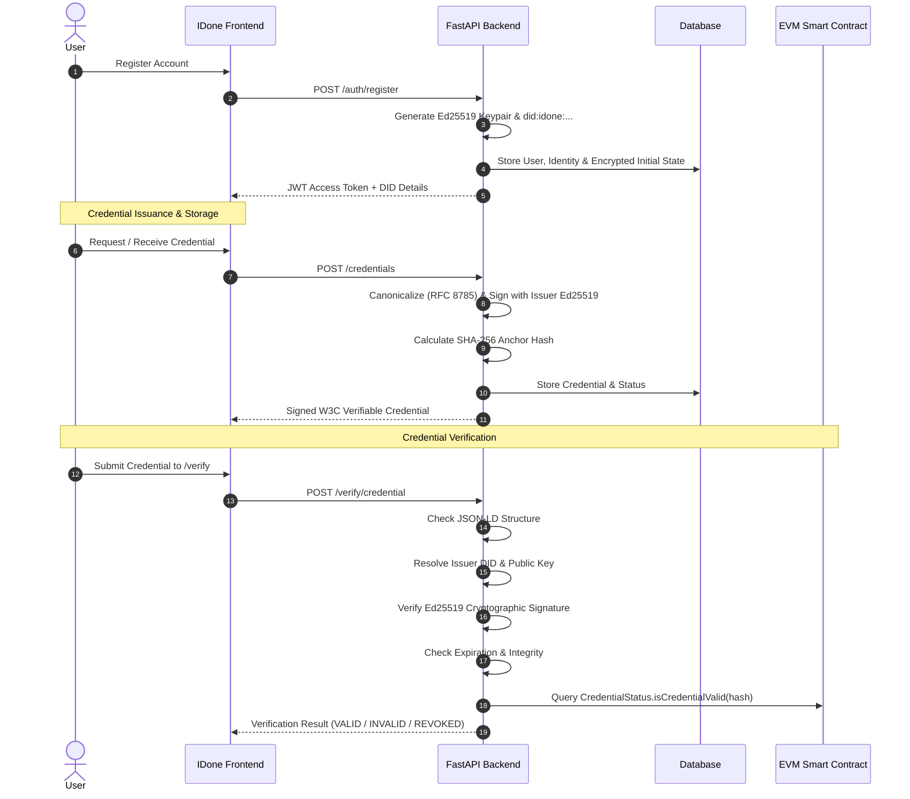

# IDone System Architecture

IDone is a privacy-first, decentralized identity vault engineered to give users absolute sovereignty over their digital credentials and identity data.

```
┌───────────────────────────────────────────────────────────────────────────────┐
│                               IDone Application                               │
├───────────────────────────────┬───────────────────────────────────────────────┤
│    Frontend (Next.js + TS)    │          Backend API (FastAPI)                │
│                               │                                               │
│  - WebCrypto AES-256-GCM      │  - Argon2id Password Hashing                  │
│  - Ed25519 Client Verification│  - Ed25519 Authority Signing                  │
│  - Selective Disclosure UX    │  - W3C DID Resolution Engine                  │
│  - Strict Solid Color System  │  - Zero-Knowledge Vault Persistence           │
│  - Responsive Mobile / Desk   │  - Cryptographic Verification Engine          │
└──────────────┬────────────────┴───────────────────────┬───────────────────────┘
               │                                        │
               ▼                                        ▼
┌───────────────────────────────┐        ┌──────────────────────────────────────┐
│       Database Layer          │        │       EVM Blockchain Anchors         │
│                               │        │                                      │
│  - PostgreSQL (Primary)       │        │  - IdentityRegistry.sol              │
│  - SQLite (Dev fallback)      │        │  - CredentialStatus.sol              │
│  - Encrypted payloads only    │        │  - Cryptographic hashes ONLY         │
│  - Zero plaintext secrets     │        │  - NO PII (Names/Docs) on chain      │
└───────────────────────────────┘        └──────────────────────────────────────┘
```

---

## 1. Core Architectural Tenets

### 1. Zero-Knowledge Digital Locker
Sensitive credentials and vault items are encrypted with AES-256-GCM using client-derived keys. The backend stores only ciphertext, 96-bit initialization vectors (IV), and authentication tags. Even in the event of a full server database compromise, attackers obtain only ciphertext.

### 2. Off-Chain PII, On-Chain Cryptographic Anchors
Personally Identifiable Information (PII) such as legal names, degrees, national IDs, and identity documents are **never** committed to the blockchain. Instead:
- The credential data is canonicalized (RFC 8785) and hashed using SHA-256 / Keccak-256.
- Only the 32-byte hash anchor and revocation status are registered on-chain via smart contracts (`IdentityRegistry.sol` and `CredentialStatus.sol`).

### 3. W3C Standards Alignment
IDone adheres to the W3C standards:
- **Decentralized Identifiers (DIDs) v1.0**: Identifier syntax `did:idone:<multihash_or_fingerprint>` resolvable into standard W3C DID documents containing public verification methods (`Ed25519VerificationKey2020`).
- **Verifiable Credentials (VC) Data Model v1.1**: Self-contained JSON-LD payloads signed by accredited issuer authorities with cryptographic proofs (`Ed25519Signature2020`).

---

## 2. Component Breakdown

### Frontend Layer (`frontend/`)
- **Next.js App Router**: Optimized, server-rendered and client-hydrated application.
- **TypeScript**: Strict type definitions for W3C schemas, cryptographic keys, and API contracts.
- **Tailwind CSS**: Adheres to the strict solid-color palette with zero gradients:
  - Deep Navy `#0F172A`
  - Off White `#F8FAFC`
  - Blue `#2563EB`
  - Green `#16A34A`
  - Red `#DC2626`
  - Amber `#D97706`
  - Gray `#64748B`
- **Client-Side Cryptography (`lib/crypto.ts`)**: Direct browser WebCrypto primitives for deterministic encryption and decryption.

### Backend Layer (`backend/`)
- **FastAPI**: Asynchronous, performant Python microframework.
- **Security Primitives (`security.py`)**:
  - `Argon2id` for password hashing via memory-hard functions resistant to GPU cracking.
  - `AES-256-GCM` authenticated symmetric encryption.
  - `Ed25519` asymmetric signatures for credential issuing and tamper-proof verification.
- **Data Access (`database.py` & `models.py`)**: SQLAlchemy with PostgreSQL connection pooling and resilient local SQLite fallback.

### Blockchain Layer (`blockchain/`)
- **`IdentityRegistry.sol`**: Maps `keccak256(did)` to owner address and activation status.
- **`CredentialStatus.sol`**: Maps `keccak256(credentialId)` to revocation status and reason hashes.
- **`deploy.ts`**: Deployment script targeting any EVM-compatible chain (Sepolia, Polygon, Arbitrum, Ethereum).

---

## 3. Credential Lifecycle Workflow



---

## 4. Selective Disclosure Protocol

When sharing credentials, the holder can choose which claims to expose:
1. The user opens the **Share Credential** dialog.
2. The user toggles specific claims (e.g. `degreeTitle`, `issuer`, `issuanceDate`) and opts out of sensitive attributes (e.g. `ssn`, `birthDate`, `homeAddress`).
3. A filtered Verifiable Presentation is compiled and timestamped.
4. The recipient verifies the presentation without ever observing redacted data.
